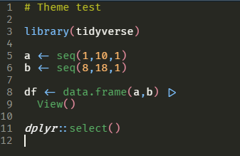

# Rstudio_theme

Modified version of Monokai dark theme for Rstudio. To install it and
make it work download this repository (`code > Download .zip`) and:

1.   Install the font Fira (which allows to use ligatures), included in
    this repository

2.  Ensure "Highlight R function calls" is ticked in Rstudio.

    To do so, in Rstudio go to
    `Tools > Global Options > Code > Display > Syntax`

3.  Add `Pablo_RS.rstheme` to Rstudio themes:

    To do so, go to `Tools > Global Options > Appearance > Add`

4.  Finally, select the theme and apply. Also select Fira as the editor
    font

C
